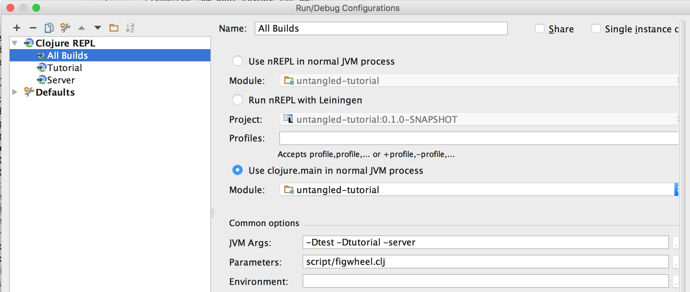

# Untangled Developers Guide

This is an interactive developers guide for developing applications with 
Untangled. It is meant to be cloned locally, as the included
exercises require you to extend and edit the code.

## What's inside?

This guide covers all of the elements of Untangled, including the 
necessary elements of the underlying Om library (on which much of the 
system is based).

# Running It

## Figwheel

The following builds are configured in figwheel:

- `devguide`: This is the main guide.

- `test`: Tests for the client application (for you to see/extend)

### IntelliJ/Cursive

The project is set up for an optimal experience in IntelliJ with Cursive:

- Running selected figwheel builds using run configurations
- Integration with REPL commands (e.g. send form to REPL from editor)

To accomplish this, we chose to use figwheel sidecar and script it. The
code is organized so that if you wish to use nREPL with Emacs/vi you
can get the same features (documentation coming soon).

The `dev/server/user.clj` contains the primary code, which is in turn 
invoked by the `script/figwheel.clj` file. You select builds by specifying
`-Dbuild_name` as a JVM option (any number of times). Thus, you can
run one or many builds.

To configure this in IntelliJ:

- Edit Run Configurations
- Press +, and add a Clojure Local REPL. Name it something like "All builds"
- Choose "Use Clojure Main" (see image below)
- Add `-Dn` options to the JVM Args for each build you want to run, where `n` is a build
defined in the `:cljsbuild` section of the `project.clj` file.
- Set parameters to `script/figwheel.clj`



You should now be able to run the builds via the IDE.

### Command line

```
JVM_OPTS="-Ddevguide" lein run -m clojure.main script/figwheel.clj
```

## Accessing the Guide and the Tests:

The guide should be visible at: http://localhost:3449
The tests should be visible at: http://localhost:3449/test.html

### Figwheel notes

Once the figwheel REPL is going, you can clean and rebuild with 

```
(reset-autobuild)
```

after which you probably want to reload the page in your browser to clear out any cruft.

Sometimes (rarely) it is necessary to just stop it all, clean everything with `lein clean` and
restart.

## Server

Some of the exercises have you run a web server.
Running the server is pretty simple. It is set up to run just fine from nREPL or clojure main. 

You *must* first copy a default configuration file from resources/config/defaults.edn to
/usr/local/etc/app.edn.

### IntelliJ

Add a run configuration for a Local Clojure REPL, and do NOT specify parameters (JVM args are
fine, of course).

### Command line

```
lein repl
```

or

```
lein run -m clojure.main
```

### Using the Server REPL

Once you have a server REPL going, you can start the server (and refresh/reset it at any time).
The server is written using the components library, so it is trivial to hot reload.

Starting the server:

```
user=> (go)
```

Code refresh/server restart:

```
user=> (reset)
```

If you get compile errors, you'll need to manually refresh the source:

```
user=> (refresh)
```

DO NOT do a refresh while the server is running, only IF a compile fails
(at which point the server will have been stopped). If you accidentally
refresh while the server is running you will not be able to start it
because the old server will have the port, but you will not be able to
stop it. If this happens you must kill/restart you REPL.
